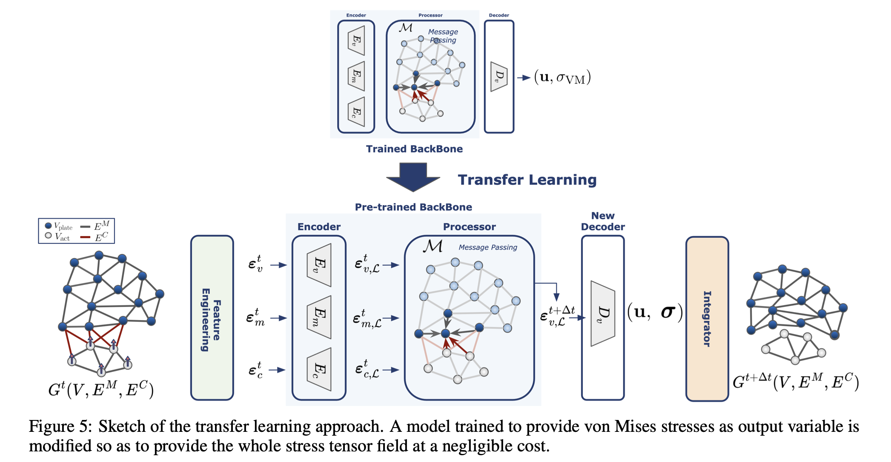
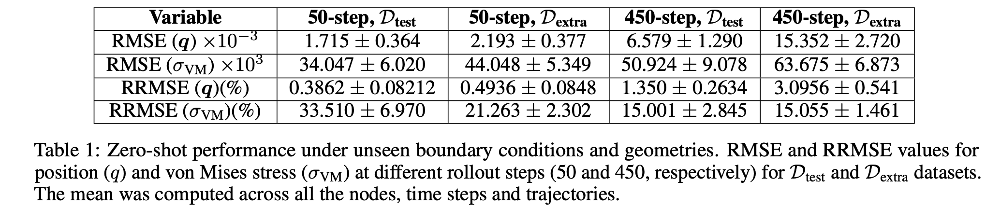
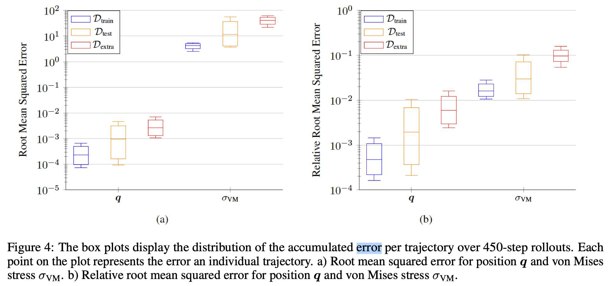

# Plasticity-MeshGraphNets: AI data-driven explicit solver for plastic collisions

## Overview
This repository corresponds to the Solid Mechanics experimental part section 3.1 of the paper *"On the feasibility of foundational models for the simulation of physical phenomena"* by A.Tierz & **Mikel M. Iparraguirre** (et al. 2024) [https://arxiv.org/pdf/2410.14645].



This repository contains the implementation and dataset for AI-driven simulations of contact and plasticity phenomena in solid mechanics. The study focuses on a worst-case scenario involving highly nonlinear behaviors such as plastic deformation and contact mechanics. To model these highly nonlinear behaviors, we extend **MeshGraphNets (MGN)** to account for plasticity and energy dissipation due to permanent deformations. Previous works using MGN have been mostly limited to hyperelastic materials, making this an important step in capturing more complex material responses.

## Problem Definition

We simulate the impact of a cylindrical actuator on a rectangular plate, where plasticity and contact interactions are the primary nonlinearities. The main characteristics of the setup are:

- **Plate dimensions**: Length = 0.5, Width = 0.25.
- **Material properties**:
  - Young’s modulus: 210
  - Poisson’s coefficient: 0.3
  - Yield stress: 300 (with hardening behavior)
- **Actuator**: Cylindrical rigid body impacting the plate at varying positions.
- **Mesh information**:
  - Plate: ~600 nodes (varies slightly based on hole position and size).
  - Actuator: 450 nodes.
- **Dataset**:
  - 135 high-fidelity finite element simulations.
  - Each simulation consists of 435 pseudo-time steps under quasi-static conditions.
  - Variability in boundary conditions and geometry (holes of different sizes and positions, variable thickness).

### Dataset Split

- **Training Set**: 80 trajectories  
- **Validation Set**: 10 trajectories  
- **Test Set**: 20 trajectories  
- **Out-of-distribution Test Set (Dextra)**: 25 trajectories with unseen geometries  

## Results

### Table Errors
Below is a summary of the zero-shot performance under unseen boundary conditions and geometries. RMSE and RRMSE values for position q and von Mises stress sigma_vm at different rollout steps (50 and 450) for D_test and D_extra datasets.


### Box Plots


## Installation & Usage

To get started with this repository, follow these steps:

1. Clone the repository:
   ```sh
   git clone https://github.com/mikelunizar/Plasticity-MeshGraphNets
   cd Plasticity-MeshGraphNets
   ```
2. Install dependencies:
   ```sh
   pip install -r requirements.txt
   pip install -e .
   ```
3. Train your model from scratch for V.Mises Stress:
   ```sh
   python train.py --mp_steps=15 --hidden=128 --batch_size=2 --epochs=10000
   ```
3. Train your model with transfer learning for complete stress tensor:
   ```sh
   python train.py --pretrain=./output/plasticity_vmises/weights/model.pth --stress_tensor --finetuning --epochs=100
   ```

4. Evaluate model:
   ```sh
   python src/evaluation/test_performance.py --path=output/plasticity_vmises/weights/model.pth --split=test
   ```

## Visual Representation

Below is a representative example of the developed solver


## Citations

```sh
@article{yourcitation2025,
  title={ON THE FEASIBILITY OF FOUNDATIONAL MODELS FOR THE SIMULATION OF PHYSICAL PHENOMENA},
  author={Your Name and Collaborators},
  journal={Your Journal},
  year={2025},
  url={https://arxiv.org/pdf/2410.14645}
}
```
